# 🛡️ Lab 9 : Audit de Sécurité Android avec Drozer

## 📋 Présentation du Projet
Ce laboratoire est dédié à l'analyse de la surface d'attaque d'une application Android vulnérable (**DIVA - Damn Insecure and Vulnerable App**) en utilisant **Drozer**, l'outil de référence pour l'audit de sécurité des applications Android. L'objectif est d'identifier les composants exposés (Activities, Services, Broadcast Receivers, Content Providers) et d'évaluer les risques associés selon les standards **OWASP MASVS**.

---

## 🎯 Objectifs Pédagogiques
*   Maîtriser l'utilisation de **Drozer** pour l'analyse dynamique.
*   Identifier les composants Android exposés et leurs vulnérabilités.
*   Évaluer les risques de sécurité liés aux mauvaises configurations.
*   Proposer des remédiations conformes aux standards **OWASP MASVS**.

---

## 🛠️ Configuration de l'Environnement

### Étape 1 : Préparation et Connexion
Vérification des outils et installation de l'agent Drozer sur l'émulateur.

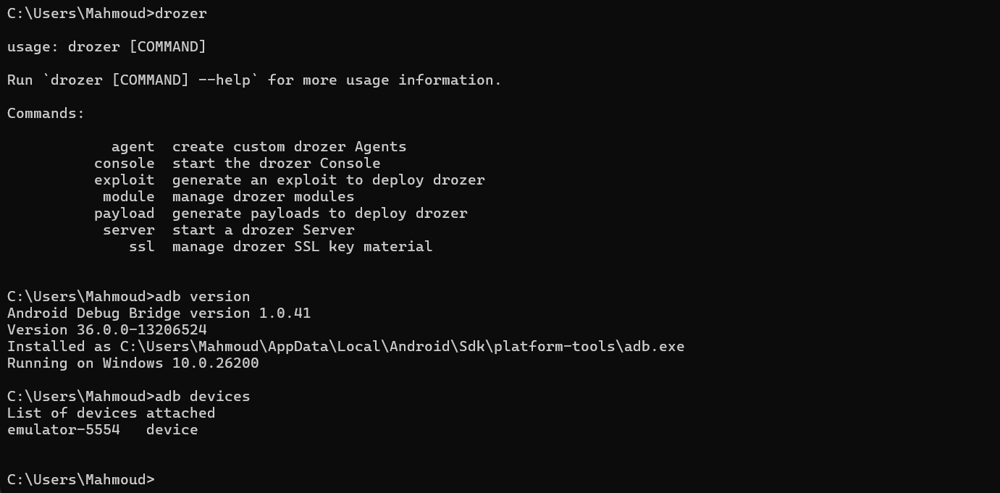
*Figure 1 : Vérification de l'installation d'ADB et Drozer sur la machine hôte.*

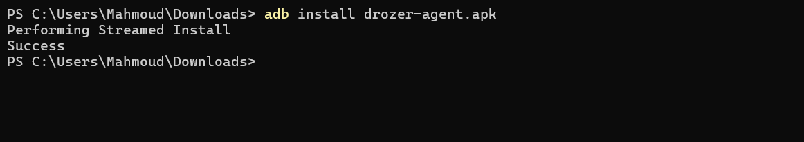
*Figure 2 : Installation de l'agent Drozer sur l'émulateur via ADB.*

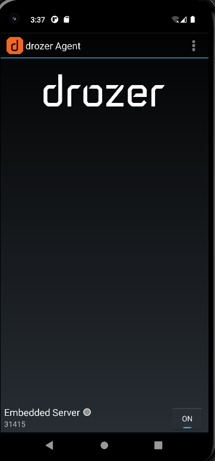
*Figure 3 : Activation de l'Embedded Server sur l'agent Drozer.*

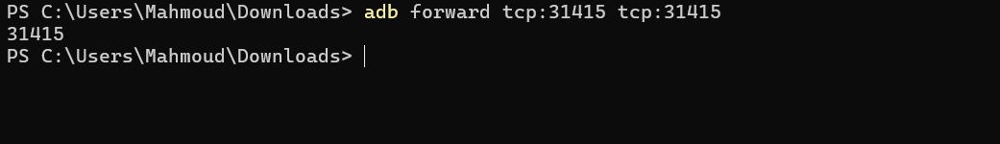
*Figure 4 : Configuration du port forwarding pour permettre la communication.*

---

## 🔍 Analyse de la Surface d'Attaque

### Étape 2 : Connexion à la Console
Connexion réussie entre la machine hôte et l'agent Drozer.

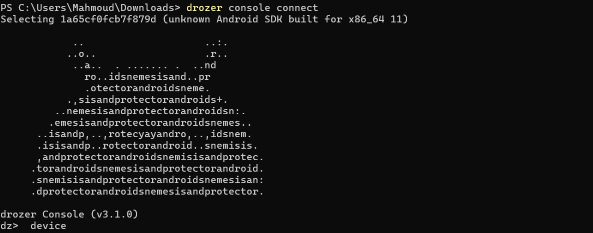
*Figure 5 : Lancement de la console Drozer et connexion à l'appareil.*

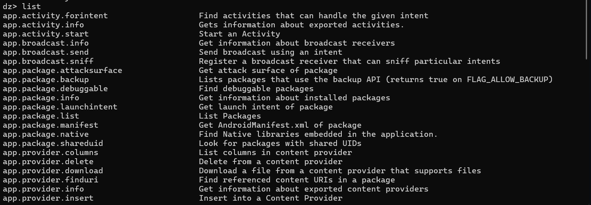
*Figure 6 : Exploration des modules Drozer disponibles pour l'audit.*

### Étape 3 : Cartographie des Composants
Identification du package cible `jakhar.aseem.diva` et de ses composants.

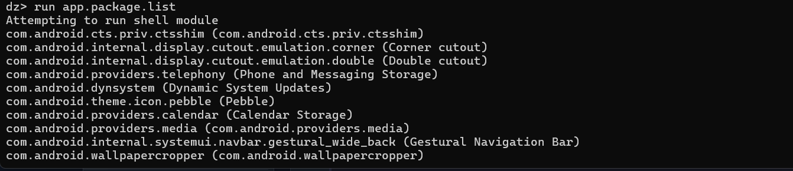
*Figure 7 : Liste de toutes les applications installées sur l'émulateur.*

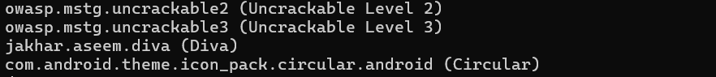
*Figure 8 : Localisation précise de l'application DIVA.*

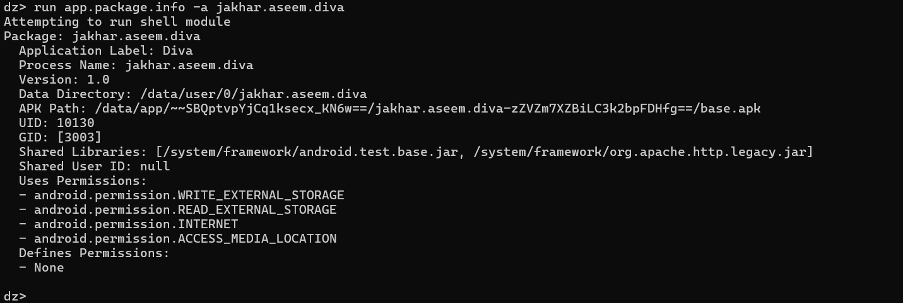
*Figure 9 : Informations détaillées sur le package (Permissions, Chemins, etc.).*

#### 📱 Analyse des Activities
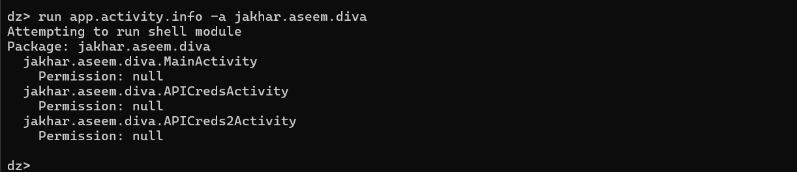
*Figure 10 : Identification des activités exportées sans protection.*

#### ⚙️ Analyse des Services
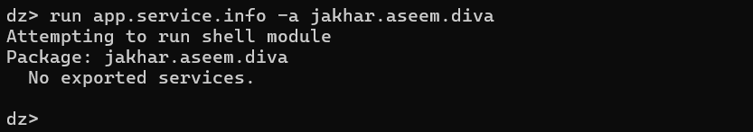
*Figure 11 : Vérification des services (Aucun service exporté détecté).*

#### 📂 Analyse des Content Providers
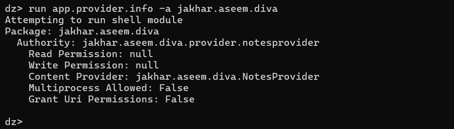
*Figure 12 : Découverte d'un Content Provider critique exposé sans permission.*

---

## 🛡️ Analyse des Protections et Manifeste

### Étape 4 : Inspection du Manifeste et des URIs
Analyse approfondie du fichier `AndroidManifest.xml` et test d'accessibilité des URIs.

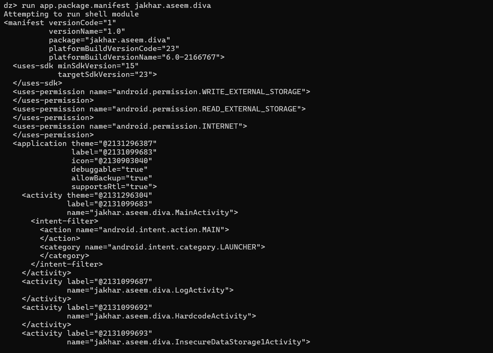
*Figure 13 : Extraction et analyse du manifeste de l'application.*

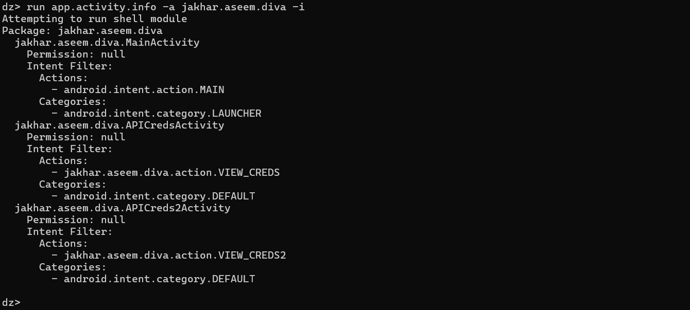
*Figure 14 : Examen des intent-filters pour comprendre comment les activités sont déclenchées.*

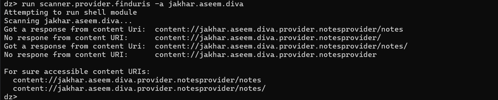
*Figure 15 : Scan automatique des URIs accessibles sans permissions.*

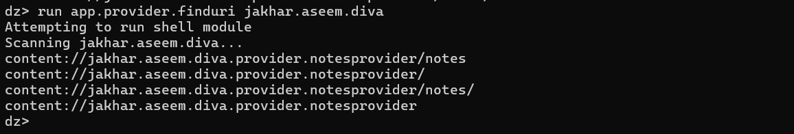
*Figure 16 : Confirmation de l'accessibilité des données sensibles via le Provider.*

---

## 📊 Tableau de Triage des Vulnérabilités

| ID | Composant | Vulnérabilité | Sévérité | Impact | Statut |
|:---|:---|:---|:---|:---|:---|
| **V1** | `MainActivity` | Exportée sans protection | Élevée | Contournement d'authentification | À corriger |
| **V2** | `APICredsActivity` | Exposition de credentials via Intent | Critique | Fuite de clés API sensibles | À corriger |
| **V3** | `NotesProvider` | URI accessible sans permission | Critique | Fuite/Modification de données privées | À corriger |
| **V4** | Application | `debuggable="true"` | Élevée | Manipulation mémoire et données | À corriger |
| **V5** | Application | `allowBackup="true"` | Moyenne | Extraction de données via ADB | À corriger |

---

## 🗺️ Mapping OWASP MASVS

| ID | Référence MASVS | Description de la Vulnérabilité |
|:---|:---|:---|
| **V1/V2** | **MSTG-PLATFORM-1** | L'application ne doit exposer que les composants nécessaires. |
| **V3** | **MSTG-STORAGE-2** | Aucune donnée sensible ne doit être stockée sans protection adéquate. |
| **V4** | **MSTG-RESILIENCE-1** | L'application ne doit pas être exécutable avec des outils de débogage. |
| **V5** | **MSTG-STORAGE-1** | Protection contre l'extraction de données via les sauvegardes système. |

---

## 🛠️ Remédiations Préconisées

### 1. Sécurisation des Activities
Désactiver l'exportation pour toutes les activités qui ne sont pas des points d'entrée principaux.
```xml
<!-- Avant -->
<activity android:name=".APICredsActivity" android:exported="true" />

<!-- Après -->
<activity android:name=".APICredsActivity" android:exported="false" />
```

### 2. Protection du Content Provider
Ajouter des permissions de lecture/écriture de niveau `signature`.
```xml
<provider
    android:name=".NotesProvider"
    android:authorities="jakhar.aseem.diva.provider.notesprovider"
    android:exported="true"
    android:readPermission="com.diva.permission.READ_NOTES"
    android:writePermission="com.diva.permission.WRITE_NOTES" />
```

### 3. Durcissement du Manifeste
Désactiver le débogage et le backup en production.
```xml
<application
    android:debuggable="false"
    android:allowBackup="false"
    ... >
```

---

## 🏁 Conclusion
Cet audit via **Drozer** a mis en évidence des failles de configuration majeures dans l'application DIVA. L'exposition non protégée des activités et des providers permet à n'importe quelle application malveillante de subtiliser des informations sensibles. L'application des remédiations proposées permettrait d'atteindre un niveau de sécurité conforme aux exigences de l'**OWASP MASVS**.

---
**Auditeur :** Laasri Mahmoud  
**Outils :** Drozer, ADB, Émulateur Android (API 29)
